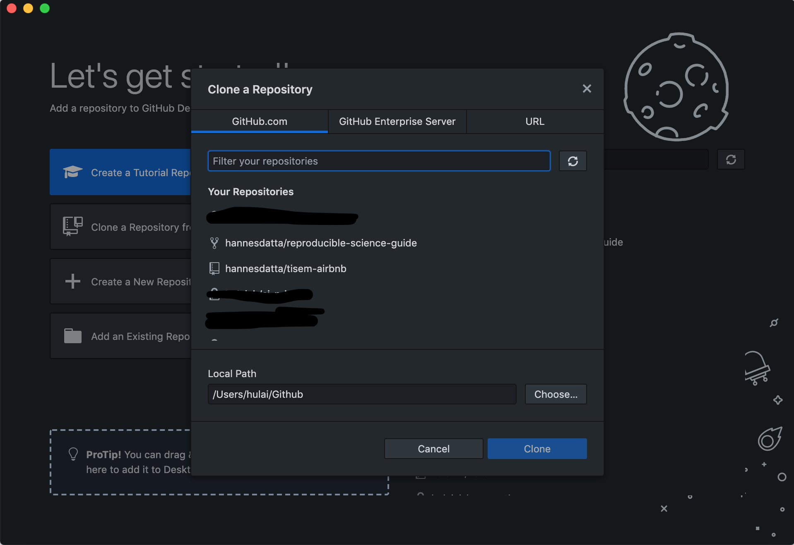
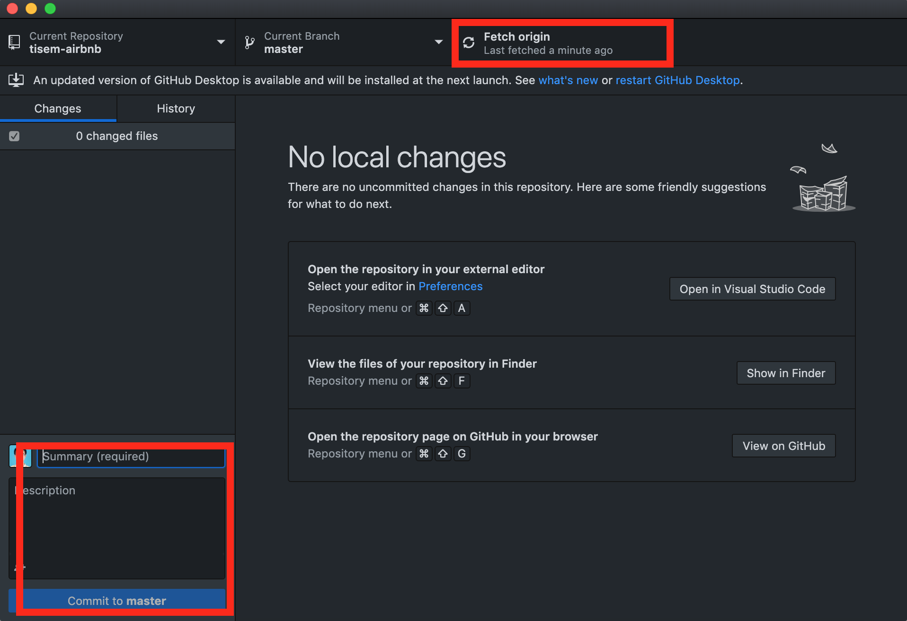

# Installing Git and Setting Up Accounts

Git is a Version Control System (VCS) that has gained a lot of traction among the programming community.
We will use version control to keep track of the files we write, and the changes we make to them.

## Account Creation

During the course we will show you how to use [GitHub](https://www.github.com) to host some of your work and do code related project management. You will need to set up an account:

*   Please [register for a GitHub account](https://github.com/join) 

## Installation

### Windows Users

Download and install the latest versions of [msysgit](http://msysgit.github.io)

After installing these programs use Windows Explorer to go to a folder that contains some documents (any folder) and right click on it.
You should see some additional items - "GitBash" appear in the context menu upon right-clicking.

!!! danger "Making Git available via the PATH settings on Windows"
    We need to update our PATH settings; these settings are a set of directories that Windows uses to "look up" software to startup. 

    - Right-click on Computer. 
    - Go to "Properties" and select the tab "Advanced System settings". 
    - Choose "Environment Variables" and select `Path` from the list of system variables.
    - Choose `Edit`.
    	- **Windows 7 and 8 machines:**
    		If you chose your installation directory to be C:\R\R-3.6.1\ during your installation (i.e., you did not use the default directory), copy and paste the following string without spaces at the start or end:
    
            `;C:\Program Files\Git\bin`
    
    	- **Windows 10 machines:**
    		- Click `New` and paste the following string:
    
            `C:\Program Files\Git\bin`
    
    		- Click on `OK` as often as needed.

### Mac Users

On MacOS, download and install Git from [here](http://git-scm.com/download/mac). If your system says it can't be opened, because it is from an unidentified developer, then open it via right-lick and `open`.
Also install the command-line auto-completion script. For this go to [this website](https://github.com/git/git/raw/master/contrib/completion/git-completion.bash). You should now see a the text file starting with

```
# bash/zsh completion support for core Git.
#
# Copyright (C) 2006,2007 Shawn O. Pearce <spearce@spearce.org>
# Conceptually based on gitcompletion (http://gitweb.hawaga.org.uk/).
# Distributed under the GNU General Public License, version 2.0.
```

save this file as `git-completion.bash` to your user folder by pressing `CMD+s`. If you want to know where your user folder is, open a terminal and type ```pwd```. For Uli it is for example under `/Users/ubergmann`.

If you use Safari, make sure to save the file as `Page Source` and don't append a `.txt` to its filename (Chrome does this automatically). If everything went right, you can now type `ls` in your terminal window and should see `git-completion.bash` there between other files.


### Linux Users

Follow the steps documented [here](https://git-scm.com/download/linux) to install on Linux from the terminal.

!!! danger
    To install system software using `apt-get`, you need `Super User` rights. So please add `sudo` in front of each `apt-get` command in the document above, like so: ```sudo apt-get install git```


## Verifying your installation

<!-- We will need to make Git accessible from the command line. Windows and Mac users will need to follow the steps on the page "Modifying Path Settings." Linux users will already have git accessible from the command line. -->

To verify your installation, type the following command in a terminal and press the return key:

```bash
       git --version
```

You should get an output that looks like:

```bash
        git version 2.18.0
```

Ensure that you have a version greater than `2.15.0` installed.

## A short instruction for Git

### Before we start

- Configure

In order to use Github locally, you can configure your user name and email of your Github account in local PC. In your terminal, you can type the following command to configure.

```bash
# set the author name for your commits
git config --global user.name "[name]"

# set the author email for your commits
git config --global user.email "[email address]" 
```

When you finish the configuration, you can type `git config --list` to check the user information.

### A typical workflow

1. Create a repository on Github

   To start, you need to create a repository once. You can create a repository on Github and then clone to your local PC. Or you can fork other's repository and then clone to your local PC.

   

   `New repository` or `fork other's repository` ->  copy `git@github.com:username/newrepository.git` -> go to the folder that you want to put the repository locally `cd localfolder` -> 

   ```bash
   # clone an existing repository from Github to local PC
   git clone git@github.com:username/newrepository.git`
   ```

2. Commit local change

   Each time when you change you programs, you can record snapshots permanently in version history, so that you can check every version in the future in case. **Commit Frequently!**

   ```bash
   # record file snapshots permanently in version history
   git commit -m "[descriptive message]"
   ```

3. Push to Github

   Since you are cooperating with coauthors, you can share your changes by uploading all local branch commits to GitHub. **Push Frequently!** But less frequent than `Commit`.

   ```bash
   # upload all local branch commits to GitHub
   git push
   ```

### If you prefer graphical UI

The typicla workflow can be realized by graphical *Github Desktop*. [Download GIthub Desktop](https://desktop.github.com).

- Log in your Github account

- `file`->`clone repository`->choose `repository` and `local path`, then `clone`

  

- `commit` with a description message on the down left, then `push` on the up right.

  

### More about Git

1. Branches

Branches are key tools for version control. Everyone can make changes to his own working branch, and merge their changes to a master branch. You can use `git status` to check your working branch.

``` bash
  # create a branch [branch-name]
  git branch [branch-name]

  # switch to s specific branch [branch-name]
  git checkout [branch-name]

  # merge a specific branch [branch] to the working branch
  git merge [branch]

  # delete a specific branch [branch-name]
  git branch -d [branch-name]
```