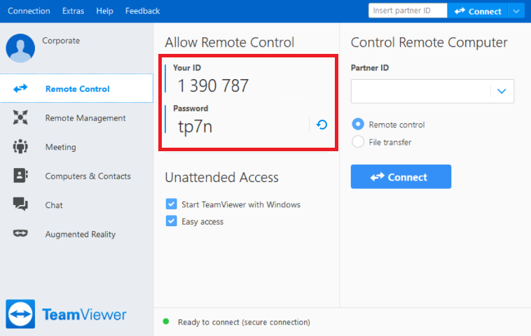

# Teamviewer

Getting feedback on code or solving technical problems is crucial to your learning experience. 
When working remotely, we prefer to make use of **Teamviewer**,
which allows us to *remote-control* your computer and help you right away (while you're watching, of course!). 

## Installing Teamviewer

To install Teamviewer, go to the [Teamviewer homepage](https://www.teamviewer.com/en/download/windows/) and download the installer for your operating system.
We recommend you to install Teamviewer *permanently*. If you do not have admin rights, it's fine to only select *run once*.

Please indicate you download Teamviewer for *private use*. We have purchased a Teamviewer license, so that we can attend your session.

## Starting a Teamviewer session

Open TeamViewer via the start menu, select **remote control** on the left side of your screen (it's the default), and note down **your ID** and **your password**. When talking or texting with us, please give us this ID (which is parmanent),
and your passport (which is only a temporary password). 

We can then access your computer, and you can watch us.

Also want to talk to us? Make sure you have a headset connected to your computer.

!!! warning "Remember to change your password!"
	Please change your password as soon as the session with us has ended. 
	To do so, 
	
	- just hover over the password area with your mouse, 
	- click on the little blue icon appearing on the right of it, and 
	- select generate a new random password.
	
	This will keep your computer safe!
	
